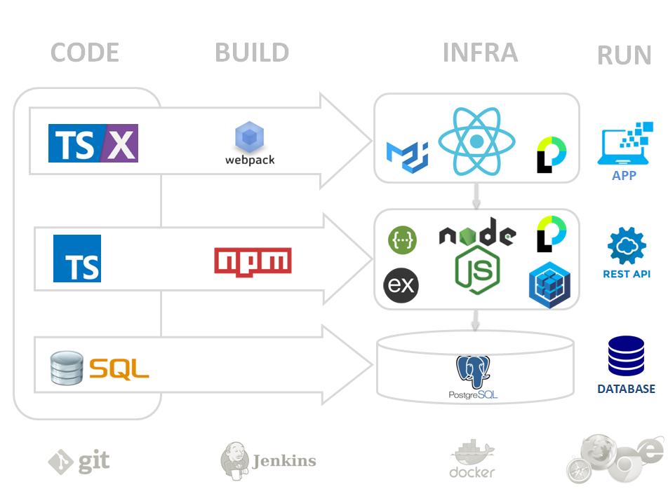

/!\ WORK IN PROGRESS /!\
========================

typescript-sql-node-react
=========================

This technical stack is not the state-of-the-art, but a stable one (no need to wory for 1-2 years). It's usefull for long-term support apps, like Business or IT Intranet webapps.





# Stack

## Project view

| Area     | Product                | Plugins or Impl                 |
| :------: | ---------------------: | ------------------------------: |
| Language | TypeScript             |                                 |
| UI       | Bootstrap              | JQuery                          |
| App      | ReactJS                | react-router, react-intl, redux |
| API      | HTTP-client, ExpressJS | Swagger (OpenAPI)               |
| Data     | Sequelize, SQL         | SQLite, PostGreSQL              |
| Secu     | Passport               |                                 |

## Stack view

| Layer            | Product     | Plugins or Impl                 |
| :--------------: | ----------: | ------------------------------: |
| Client (browser) |             |                                 |
|                  | Bootstrap   | JQuery                          |
|                  | ReactJS     | react-router, react-intl, redux |
|                  | HTTP-client | Swagger (OpenAPI)               |
|                  | Passport    |                                 |
| Server (NodeJS)  |             |                                 |
|                  | ExpressJS   | Swagger (OpenAPI)               |
|                  | Passport    |                                 |
|                  | Sequelize   |                                 |
| Database (dev)   |             |                                 |
|                  | SQLite      | SQL                             |
| Database (prod)  |             |                                 |
|                  | PostGreSQL  | SQL                             |

# Usage

Get
```
git clone https://github.com/DamienFremont/typescript-sql-node-react-starter.git
cd typescript-sql-node-react-starter
```

Execute DEV

```
npm install -g create-react-app
npm run devinstall

npm run dev
```

Execute PROD
  - linux & mac: `export NODE_ENV=production`
  - windows: `set NODE_ENV=production`
  - win powershell: `$env:NODE_ENV = "production"`
```
npm install
npm run heroku-postbuild

npm start
```

Use it
  - Go to [http://localhost:3000](http://localhost:3000)
  - Login with 'user', 'superuser' or 'admin' (login=password).

# Details

A list of available features divided into tech area. You'll find other posts about this starter here (WORK IN PROGRESS).

Legend
  - :heavy_check_mark:️ - Fully implemented as intended.
  - :warning: - Partially implemented, somewhat broken or simply still not mature enough.
  - :x: - Not implemented yet or currently unusable.
  - :no_entry: ️ - Will not be implemented (see note).
  - :grey_question: - Not verified or tested.

## Table of Contents
  - [Packaging](#packaging)
  - [App](#app)
  - [Form](#form)
  - [Data-Table](#data-table)
  - [Security](#security)
  - [Workflow](#workflow)

## Packaging

| Feature            | State              | Note |
| :----------------: | -----------------: | ---: |
| dependencies-fixed | :x:                |      |
| build-dev          | :heavy_check_mark: |      |
| build-prod         | :heavy_check_mark: |      |
| conf-env           | :x:                |      |
| conf-file          | :x:                |      |
| conf-placeholder   | :x:                |      |
| data-message-json  | :heavy_check_mark: |      |
| data-dataset       | :x:                |      |
| data-schema        | :x:                |      |

## App

| Feature               | State              | Note                         |
| :-------------------: | -----------------: | ---------------------------: |
| project-structure     | :heavy_check_mark: | Packages, components, layers |
| rendering-client-side | :heavy_check_mark: |                              |
| rendering-server-side | :x:                |                              |
| rendering-isomorphic  | :x:                |                              |
| local-langa-detect    | :heavy_check_mark: |                              |
| local-langa-change    | :warning:          |                              |
| icons                 | :heavy_check_mark: |                              |
| layout-grid           | :heavy_check_mark: |                              |
| layout-navbar         | :x:                |                              |
| layout-breadcrumb     | :heavy_check_mark: |                              |
| layout-help           | :x:                |                              |


## Form
| Feature         | State | Note |
| :-------------: | ----: | ---: |
| form-edition    | :x:   |      |
| form-toolbar    | :x:   |      |
| form-exemple    | :x:   |      |
| form-validation | :x:   |      |
| date-picker     | :x:   |      |

## Data-Table  
| Feature          | State | Note |
| :--------------: | ----: | ---: |
| table            | :x:   |      |
| table-modal      | :x:   |      |
| table-sort       | :x:   |      |
| table-filtering  | :x:   |      |
| table-pagination | :x:   |      |
| table-export     | :x:   |      |
| table-expand-row | :x:   |      |

## Security
| Feature     | State | Note |
| :---------: | ----: | ---: |
| auth-tocken | :x:   |      |
| auth-oauth2 | :x:   |      |
| secu-role   | :x:   |      |
| secu-right  | :x:   |      |
| secu-page   | :x:   |      |
| secu-routes | :x:   |      |

## Workflow
| Feature | State | Note |
| :-----: | ----: | ---: |
| front   | :x:   |      |
| back    | :x:   |      |

* COMING SOON:

* file
  - download
  - upload
    - browse
    - drop
    - preview

* tools
  - VSC
    - settings
    - shortcuts
    - plugins
      - TS Hero
      - TODO
      - Debugger
  - Chromium
    - REST Client

* model
  - domain
    - join
  - references
    - code-name
    - label
  - entities
    - id
    - modified-by-at
    - created-by-at
    - deleted-by-at
  - uuid
  - history
    - version
    - history
    - event

* API
  - private-public
  - version
  - multilingual-i18n
  - authent
  - security

* templating
  - Mail


* tests
  - unit
  - integration
  - user-interface

* cucumber
  - Editor NON-DEV
  - build
  - refactor

* charts
  - line
  - bar

# References

* react https://github.com/Microsoft/TypeScript-React-Starter

* express https://esausilva.com/2017/11/14/how-to-use-create-react-app-with-a-node-express-backend-api/

* project structure https://reactjs.org/docs/faq-structure.html

* bootstrap https://reactstrap.github.io
* bootstrap components https://reactstrap.github.io/components/alerts/
* bootstrap layout https://reactstrap.github.io/components/layout/

* fontawesome https://fontawesome.com/how-to-use/on-the-web/using-with/react
* fontawesome config https://github.com/FortAwesome/react-fontawesome
* fontawesome icons https://fontawesome.com/icons?d=gallery&q=search

* Internationalize https://phraseapp.com/blog/posts/react-i18n-best-libraries/
* Internationalize json import https://hackernoon.com/import-json-into-typescript-8d465beded79
* Internationalize change language

* file download