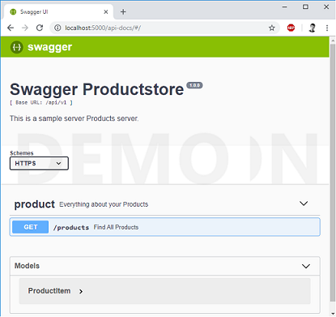

/!\ WORK IN PROGRESS /!\
========================

typescript-sql-node-react
=========================

This technical stack is not the state-of-the-art, but a stable one (no need to wory for 3-5 years). It's usefull for long-term support apps, like Business or IT Intranet webapps.


# Table of Contents
- [Introduction](#typescript-sql-node-react)
- [Stack](#stack)
- [Usage](#usage)
- [Features](#features)
- [References](#references)

---

# Stack

## Project view

|   Area   |                Product |                 Plugins or Impl |
|:--------:|-----------------------:|--------------------------------:|
| Language |             TypeScript |                                 |
|    UI    |              Bootstrap |                          JQuery |
|   App    |                ReactJS | react-router, react-intl, redux |
|   API    | HTTP-client, ExpressJS |               Swagger (OpenAPI) |
|   Data   |         Sequelize, SQL |              SQLite, PostGreSQL |
|   Secu   |               Passport |                                 |
|   Env    |                 dotenv |                                 |

## Stack view

|      Layer       |     Product |                 Plugins or Impl |
|:----------------:|------------:|--------------------------------:|
| Client (browser) |             |                                 |
|                  |   Bootstrap |                          JQuery |
|                  |     ReactJS | react-router, react-intl, redux |
|                  | HTTP-client |               Swagger (OpenAPI) |
|                  |    Passport |                                 |
| Server (NodeJS)  |             |                                 |
|                  |   ExpressJS |               Swagger (OpenAPI) |
|                  |    Passport |                                 |
|                  |   Sequelize |                                 |
|                  |      dotenv |                                 |
|  Database (dev)  |             |                                 |
|                  |      SQLite |                             SQL |
| Database (prod)  |             |                                 |
|                  |  PostGreSQL |                             SQL |

---

# Usage

Get
```
git clone https://github.com/DamienFremont/typescript-sql-node-react-starter.git
cd typescript-sql-node-react-starter
```

Execute DEV

```
npm install -g create-react-app
npm install

npm run watch
```

Execute PROD
  - linux & mac: `export NODE_ENV=production`
  - windows: `set NODE_ENV=production`
  - win powershell: `$env:NODE_ENV = "production"`
```
npm install
npm run heroku-postbuild

npm start
```

Use it
  - Go to [http://localhost:3000](http://localhost:3000)
  - Login with 'user', 'superuser' or 'admin' (login=password).

---

# Features

A list of available features divided into tech area. You'll find other posts about this starter here (WORK IN PROGRESS).

Legend
  - :heavy_check_mark:️ - Fully implemented as intended.
  - :warning: - Partially implemented, somewhat broken or simply still not mature enough.
  - :x: - Not implemented yet or currently unusable.
  - :no_entry: ️ - Will not be implemented (see note).
  - :grey_question: - Not verified or tested.

## Table of Contents
  - [Packaging](#packaging)
  - [App](#app)
  - [Form](#form)
  - [Data-Table](#data-table)
  - [Security](#security)
  - [Workflow](#workflow)

## Packaging


|     Feature      |              State |         Note |
|:----------------:|-------------------:|-------------:|
|    build-dev     | :heavy_check_mark: |              |
|    build-prod    | :heavy_check_mark: |              |
|     conf-env     | :heavy_check_mark: | NODE-ENV=... |
|    conf-file     | :heavy_check_mark: |       dotenv |
| conf-placeholder | :heavy_check_mark: |       dotenv |
|      banner      | :heavy_check_mark: |   banner.txt |
|      logger      | :heavy_check_mark: | level in env |

## App


|         Feature         |              State |                       Note |
|:-----------------------:|-------------------:|---------------------------:|
|    project-structure    | :heavy_check_mark: | components, pages, layouts |
|  rendering-client-side  | :heavy_check_mark: |                        SPA |
|  rendering-server-side  |         :no_entry: |                        SSR |
| rendering-universal-app |         :no_entry: |                 Isomorphic |
|      local-message      | :heavy_check_mark: |                       JSON |
|    local-lang-detect    | :heavy_check_mark: |                    Browser |
|    local-lang-change    | :heavy_check_mark: |                            |
|          icons          | :heavy_check_mark: |                FontAwesome |
|       layout-grid       | :heavy_check_mark: |                            |
|      layout-navbar      | :heavy_check_mark: |                            |
|      layout-routes      | :heavy_check_mark: |                            |
|       layout-help       | :heavy_check_mark: |          general and pages |
|       layout-urls       | :heavy_check_mark: |             SSR, CSR perfs |

## Accessibility

|      Feature      |              State | Note |
|:-----------------:|-------------------:|-----:|
| access-breadcrumb | :heavy_check_mark: |      |
|    access-size    | :heavy_check_mark: |   em |
| access-wcag-aria  |                :x: |      |
|  access-offline   |                :x: |      |

## Security

|    Feature    | State |          Note |
|:-------------:|------:|--------------:|
|  auth-local   |   :x: |     HTML form |
|  auth-openid  |   :x: |        OpenID |
|    auth-ad    |   :x: |          SAML |
|   secu-role   |   :x: |               |
|  secu-right   |   :x: |               |
|   secu-page   |   :x: |               |
|  secu-routes  |   :x: |               |
| user-settings |   :x: | local, remote |
|  user-profil  |   :x: |        remote |

## API



|      Feature       |              State |                  Note |
|:------------------:|-------------------:|----------------------:|
|     api-client     | :heavy_check_mark: |                       |
|     api-server     | :heavy_check_mark: |               Express |
|    api-swagger     | :heavy_check_mark: | OpenAPI, design-first |
|    api-version     | :heavy_check_mark: |           version URL |
| api-private-public | :heavy_check_mark: |                       |

## Service

|        Feature         | State |               Note |
|:----------------------:|------:|-------------------:|
|     service-store      |   :x: |                    |
|     server-authent     |   :x: |                    |
|    server-security     |   :x: |                    |
| server-data-validation |   :x: |                AJV |
|  server-local-message  |   :x: | server-side locale |

## Data

|      Feature      |              State |                  Note |
|:-----------------:|-------------------:|----------------------:|
|   file-download   |                :x: |                       |
|    file-upload    |                :x: | browse, drop, preview |
|    data-schema    | :heavy_check_mark: |                       |
|   data-dataset    |                :x: |                       |
|   data-orm-crud   |                :x: |                       |
| data-orm-paginate | :heavy_check_mark: |                       |
|  data-orm-search  |                :x: |                       |

## Entity

|    Feature     | State |                                           Note |
|:--------------:|------:|-----------------------------------------------:|
|  data-entity   |   :x: | entity, value-object, id, dates, deleted-by-at |
| data-reference |   :x: |                        reference (name, label) |
|  data-history  |   :x: |                        version, history, event |
|  data-domain   |   :x: |             UUID, join models by only one UUID |

## Workflow

|     Feature     | State | Note |
|:---------------:|------:|-----:|
| workflow-client |   :x: |      |
| workflow-server |   :x: |      |

## Form

|     Feature     |              State | Note |
|:---------------:|-------------------:|-----:|
|  form-edition   | :heavy_check_mark: |      |
|  form-toolbar   |                :x: |      |
|  form-exemple   |                :x: |      |
| form-validation |                :x: |      |
|   date-picker   |                :x: |      |
| data-validation |                :x: |  AJV |

## Data-Table  

|     Feature      |              State | Note |
|:----------------:|-------------------:|-----:|
|      table       | :heavy_check_mark: |      |
|   table-modal    |                :x: |      |
|    table-sort    |                :x: |      |
| table-filtering  |                :x: |      |
| table-pagination | :heavy_check_mark: |      |
|   table-export   |                :x: |      |
| table-expand-row |                :x: |      |

## Tests

|      Feature      | State |           Note |
|:-----------------:|------:|---------------:|
|     test-unit     |   :x: |                |
|     test-int      |   :x: |    integration |
|      test-ui      |   :x: | user-interface |
|   cucumber-edit   |   :x: |        NON-DEV |
|  cucumber-build   |   :x: |                |
| cucumber-refactor |   :x: |                |

## Charts

- charts
  - line
  - bar

## Tools

  - VSC
    - settings
    - shortcuts
    - plugins
      - TS Hero
      - TODO
      - Debugger
  - Chromium
    - REST Client
    
## Other

- templating
  - Mail

---

# References

* react https://github.com/Microsoft/TypeScript-React-Starter

* express https://esausilva.com/2017/11/14/how-to-use-create-react-app-with-a-node-express-backend-api/

* project structure https://reactjs.org/docs/faq-structure.html

* bootstrap https://reactstrap.github.io
* bootstrap components https://reactstrap.github.io/components/alerts/
* bootstrap layout https://reactstrap.github.io/components/layout/

* fontawesome https://fontawesome.com/how-to-use/on-the-web/using-with/react
* fontawesome config https://github.com/FortAwesome/react-fontawesome
* fontawesome icons https://fontawesome.com/icons?d=gallery&q=search

* Internationalize https://phraseapp.com/blog/posts/react-i18n-best-libraries/
* Internationalize json import https://hackernoon.com/import-json-into-typescript-8d465beded79
* Internationalize change language

* file download

* node ts react https://github.com/gilamran/fullstack-typescript
* node ts react https://github.com/kuldeepkeshwar/react-express-typescript-starter
* node ts react https://github.com/isaacsinuhe/create-react-app-ts-express-basic
* node ts react https://medium.com/front-end-hacking/client-server-and-shared-code-846097c5260e

* sql dump https://stackoverflow.com/questions/36392113/import-sql-dump-within-node-environment

* express ts https://mherman.org/blog/developing-a-restful-api-with-node-and-typescript/
* express ts https://github.com/Microsoft/TypeScript-Node-Starter/blob/master/package.json

* sequelize ts https://michalzalecki.com/using-sequelize-with-typescript/

* swagger express https://blog.cloudboost.io/adding-swagger-to-existing-node-js-project-92a6624b855b
* swagger ts https://github.com/DefinitelyTyped/DefinitelyTyped/blob/master/types/swagger-ui-express/swagger-ui-express-tests.ts

* datatable UI https://react-bootstrap-table.github.io/react-bootstrap-table2/
